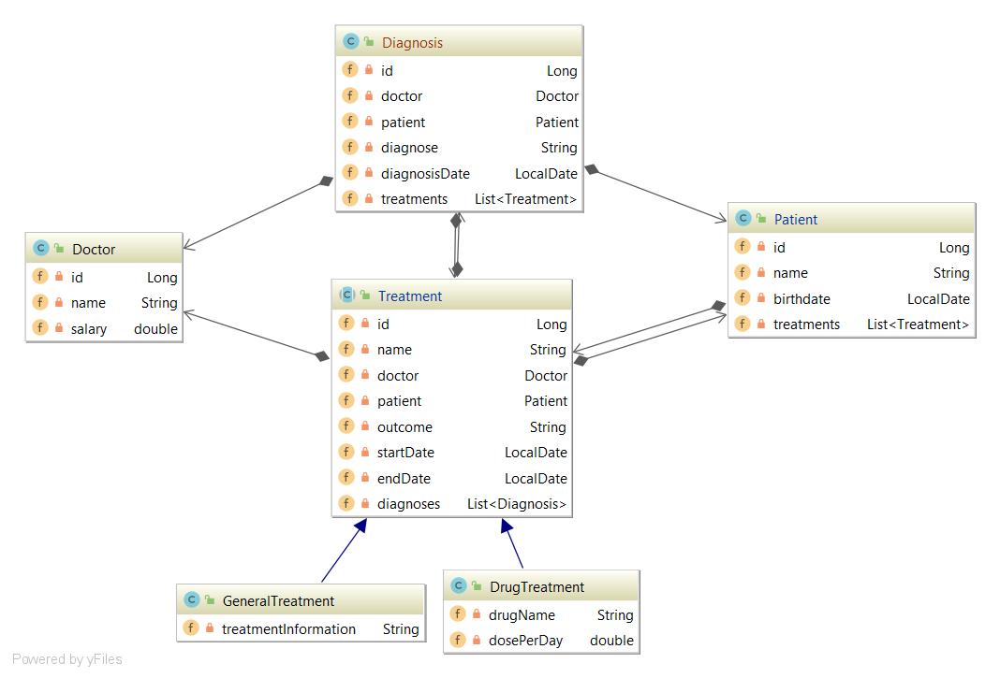

# Stefan Brandmair - Krankenhaus

Dieses Programm befasst sich mit der Verwaltung eines Krankenhauses. Derzeit befasst es sich nur mit Patienten (Patient), Doktoren (Doctor), Diagnosen (Diagnosis) und Behandlungen (Treatment)

Die assoziative Tabelle ordnet einer Behandlung die Diagnosen, welche zu der Behandlung geführt haben zu. Eine Diagnose kann zu mehreren, verschiedenen Behandlung führen (z.B. Psychotherapie und Tabletten). Eine Behandlung kann mehrere Diagnosen haben (z.B. MRT und X-Ray)

Patienten und Doktoren sind **Stammdaten**

Diagnosen und Behandlungen sind **Bewegungsdaten**

Die assoziative Tabelle zwischen den Diagnosen und Behandlungen gehört auch zu den Bewegungsdaten. 

### Klassendiagramm

### Entitaetendiagramm

